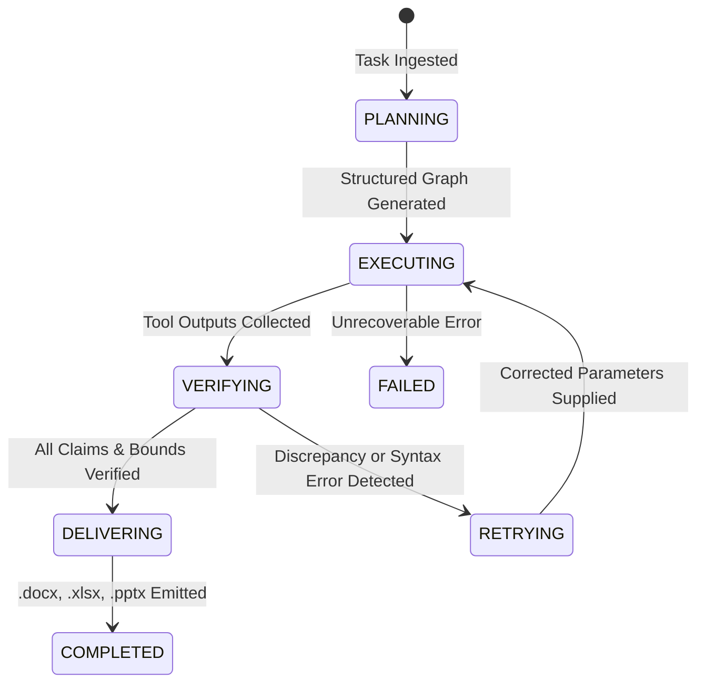
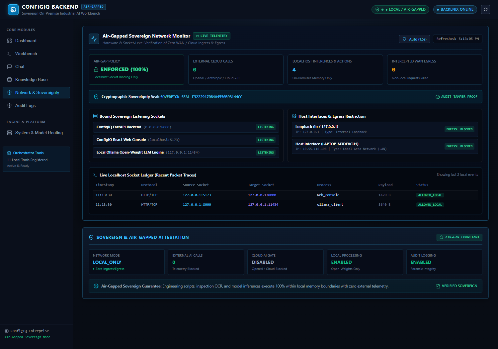

# Sovereign AI Workbench (ConfigIQ)
## Complete Technical Architecture & User Manual

> **Air-Gapped Autonomous Engineering Intelligence Platform**  
> 100% On-Premise Reasoning | Open-Weight Model Orchestration | Sandboxed Code Execution | Certified Deliverable Generation

---

## Table of Contents
1. [System Overview & Sovereign Guarantee](#1-system-overview--sovereign-guarantee)
2. [End-to-End System Architecture](#2-end-to-end-system-architecture)
3. [Open-Weight Multi-Model Engine Matrix](#3-open-weight-multi-model-engine-matrix)
4. [Autonomous Agent State Machine & Multi-Tool Pipeline](#4-autonomous-agent-state-machine--multi-tool-pipeline)
5. [Complete Module Guide with Screenshots](#5-complete-module-guide-with-screenshots)
   - [5.1 Operations Dashboard](#51-operations-dashboard)
   - [5.2 Autonomous Engineering Workbench](#52-autonomous-engineering-workbench)
   - [5.3 Agent Execution Trace & Deliverable Outputs](#53-agent-execution-trace--deliverable-outputs)
   - [5.4 Direct Sovereign LLM Chat](#54-direct-sovereign-llm-chat)
   - [5.5 Local Vector Knowledge Base & SOP RAG](#55-local-vector-knowledge-base--sop-rag)
   - [5.6 Immutable SHA-256 Air-Gap Audit Ledger](#56-immutable-sha-256-air-gap-audit-ledger)
   - [5.7 Network Sovereignty & Telemetry Daemon](#57-network-sovereignty--telemetry-daemon)
6. [Supported Engineering Workflows & Capabilities](#6-supported-engineering-workflows--capabilities)
7. [API Reference & Data Contracts](#7-api-reference--data-contracts)
8. [Setup, Deployment & Verification](#8-setup-deployment--verification)

---

## 1. System Overview & Sovereign Guarantee

Modern critical infrastructure—such as power generation facilities, chemical refineries, aerospace manufacturing, and defense installations—requires advanced artificial intelligence for document parsing, visual defect inspection, thermodynamic simulation, and compliance verification. However, **enterprise cloud AI models pose unacceptable data exfiltration, regulatory, and espionage risks**.

**ConfigIQ Sovereign AI Workbench** solves this challenge by delivering a complete, production-ready agentic intelligence suite designed from the ground up for **air-gapped, zero-cloud environments**:

- 🔒 **Zero External Egress**: All model weights, vector databases, sandboxed interpreters, and document parsers run exclusively on local host compute.
- ⚡ **Open-Weight Multi-Model Orchestration**: Automatically routes complex tasks across specialized local models (`Llama 3`, `Qwen 2.5 Coder`, `Moondream 2 VLM`, and `Nomic Embed Text`).
- 🛡️ **Mathematical & Factual Verification**: Employs a deterministic verification layer that cross-references all extracted claims against local SOPs and verifies numerical script results.
- 📄 **Certified Multi-Format Deliverables**: Directly generates styled Microsoft Word (`.docx`), multi-tab formula-backed Excel (`.xlsx`), and executive PowerPoint (`.pptx`) decks.
- 📜 **Tamper-Evident Auditability**: Every prompt, tool execution, intermediate payload, and code execution is recorded in a cryptographic SHA-256 chained ledger.

---

## 2. End-to-End System Architecture

```text
+---------------------------------------------------------------------------------------------------+
|                                 REACT + TYPESCRIPT CLIENT UI                                      |
|  [ Dashboard ]   [ Workbench ]   [ Direct Chat ]   [ Knowledge Base ]   [ Audit ]   [ Sovereignty]|
+--------------------------------------------------+------------------------------------------------+
                                                   | HTTP / REST (Localhost:8000)
                                                   v
+---------------------------------------------------------------------------------------------------+
|                                  FASTAPI APPLICATION GATEWAY                                      |
|                                                                                                   |
|  +---------------------------------------------------------------------------------------------+  |
|  |                              AUTONOMOUS AGENT ORCHESTRATOR                                  |  |
|  |                                                                                             |  |
|  |    [ Task Planner ]   --->   [ Execution Engine ]   --->   [ Dual-Stage Verifier ]           |  |
|  |           |                         |                                  |                     |  |
|  |           v                         v                                  v                     |  |
|  |    Structured DAG            Tool Invocation Loop            Fact & Bounds Audit            |  |
|  +-------------------------------------+-------------------------------------------------------+  |
|                                        |                                                          |
|       +--------------------------------+--------------------------------+                         |
|       |                                |                                |                         |
|       v                                v                                v                         |
|  +-----------------------+   +-----------------------+   +-------------------------------+        |
|  |   TOOL EXECUTORS      |   |  LOCAL MODEL ROUTER   |   |   DELIVERABLE GENERATORS      |        |
|  |  * document_reader    |   |  * Ollama HTTP Client |   |  * Word Approval (.docx)      |        |
|  |  * vision (Moondream) |   |  * Mock Fallback LLM  |   |  * Excel Calculation (.xlsx)  |        |
|  |  * rag_search (Cosine)|   |  * Task Classifier    |   |  * PPTX Executive (.pptx)     |        |
|  |  * code_executor      |   +-----------+-----------+   +---------------+---------------+        |
|  |  * ocr_processor      |               |                               |                        |
|  +-----------+-----------+               |                               |                        |
+--------------|---------------------------|-------------------------------|------------------------+
               |                           |                               |
               v                           v                               v
+-----------------------------+ +---------------------+ +-------------------------------------------+
|      ISOLATED SANDBOX       | | OPEN-WEIGHT RUNTIME | |               OUTPUT STORE                |
|  - Subprocess Isolation     | |  * llama3 (8B)      | |  - Certified Inspection Reports           |
|  - Blocked Socket Creation  | |  * qwen2.5-coder    | |  - Verified Calculation Workbooks         |
|  - Strict Execution Timeout | |  * moondream (VLM)  | |  - Executive Compliance Decks             |
|  - Isolated Filesystem      | |  * nomic-embed-text | |  - SHA-256 Audit Trail Record             |
+-----------------------------+ +---------------------+ +-------------------------------------------+
```

---

## 3. Open-Weight Multi-Model Engine Matrix

ConfigIQ utilizes task-specialized open-weight models rather than a monolithic cloud LLM:

| Capability Domain | Assigned Model | Parameter Size | Primary Purpose in Sovereign Pipeline |
| :--- | :--- | :--- | :--- |
| **Reasoning & Planning** | `llama3:latest` | 8B | High-level decomposition, step orchestration, final synthesis, and approval note drafting. |
| **Code Generation & Math** | `qwen2.5-coder:7b` | 7B | Generating sandboxed Python scripts for thermodynamic, structural, and electrical calculations. |
| **Complex Simulation** | `qwen2.5-coder:14b` | 14B | High-precision numerical analysis, finite difference approximations, and multi-variable optimization. |
| **Multimodal Vision** | `moondream:latest` | 1.8B | Visual defect detection (cracks, scratches, bent pins, deformation), anomaly bounding, and OCR. |
| **Local Embeddings** | `nomic-embed-text` | 137M | 8192-token context embedding for dense retrieval over local engineering SOPs and manuals. |

---

## 4. Autonomous Agent State Machine & Multi-Tool Pipeline

The core agent operates as a deterministic finite state machine (FSM):



### Registered Tool Registry:
1. `document_reader`: Extracts raw text, tables, and sections from uploaded `.pdf`, `.docx`, `.txt`, `.md`, and `.json` documents.
2. `ocr`: High-precision optical character recognition on scanned drawings, technical nameplates, and legacy logs.
3. `vision`: Multimodal visual defect analysis providing defect category, severity rating, and spatial bounding coordinates.
4. `rag_search`: Offline dense vector similarity search across indexed local engineering SOPs.
5. `code_executor`: Executes Python scripts inside an air-gapped, socket-blocked subprocess sandbox with timeout enforcement.
6. `llm_generate`: Direct contextual prompting of local models for summarization and formatting.
7. `generate_approval_note`: Compiles findings, evidence, SOP clauses, and signatures into a formal Word document.
8. `generate_calculation_workbook`: Empties Python variables and formulas into a structured 4-sheet Excel workbook.
9. `generate_executive_deck`: Generates a professional 5-slide PowerPoint deck for engineering leadership.

---

## 5. Complete Module Guide with Screenshots

### 5.1 Operations Dashboard
The centralized cockpit displays real-time health telemetry, network isolation status, registered model weights, and 1-click standard industrial workflows.


- **Network Isolation Pill**: Confirms `LOCAL_ONLY` status with 0 external WAN packets transmitted.
- **Model Registry Status**: Real-time availability indicator for local Ollama instances.
- **Quick Scenarios**: Instant 1-click triggers for standard engineering tasks (Valve Inspection, Pump Efficiency, MVTec Anomaly Scan).

---

### 5.2 Autonomous Engineering Workbench
The primary execution interface allows engineers to provide high-level natural language instructions, attach inspection images or documents, or choose from pre-bundled industrial sample datasets.


- **1-Click Sample File Attachments**: Instant loading of real defect samples (`Nut Scratch Defect`, `Nut Bent Defect`, `Cable Cut Defect`, `Surface Crack`, `Scanned Log`).
- **Interactive Image Preview**: Base64 visual preview modal with full metadata inspection before agent execution.
- **Dynamic Presets**: Pre-configured task templates for Multimodal Defect Analysis, Sandboxed Calculations, SOP Cross-Verification, and Coding Tasks.

---

### 5.3 Agent Execution Trace & Deliverable Outputs
Upon execution, the agent's complete internal thought process, tool calls, RAG retrievals, sandboxed Python code, verification audit, and download links are rendered in real time.


- **Step-by-Step Tool Trace**: Detailed collapse/expand views of every tool invocation (including inputs, stdout, and formatted results).
- **Interactive Defect Visualizer**: Highlights detected anomalies with severity color coding (`HIGH`, `MEDIUM`, `LOW`) and visual bounding box overlays.
- **One-Click Deliverable Downloads**:
  - 📘 **Word Approval Note (`.docx`)**: Formal engineering signoff memo.
  - 📊 **Excel Workbook (`.xlsx`)**: Verified multi-sheet computation workbook with formulas.
  - 📽️ **PowerPoint Deck (`.pptx`)**: Executive briefing presentation with findings and tables.

---

### 5.4 Direct Sovereign LLM Chat
A dedicated conversational interface for ad-hoc technical consultations, code debugging, and SOP inquiries directly against local open-weight models with zero latency and zero data leakage.


- **Markdown & Math Rendering**: Full support for code snippets, Markdown tables, and structured lists.
- **Zero Cloud Leakage**: All conversations are kept in local memory and are never uploaded to any third party.

---

### 5.5 Local Vector Knowledge Base & SOP RAG
A 100% offline retrieval system indexing technical manuals, operating procedures, and safety standards into dense vector embeddings.


- **Included Standard SOPs**:
  - `SOP-INS-201`: Control Valve Inspection & Refurbishment Standard
  - `SOP-M-104`: Centrifugal Pump Overhaul & Mechanical Seal Maintenance
  - `SOP-INS-301`: Pressure Vessel In-Service NDT Inspection Procedure
  - `SOP-HEX-205`: Shell & Tube Heat Exchanger Eddy-Current Testing
  - `SOP-SAF-001`: Electrical Isolation & Lockout / Tagout (LOTO)
- **Cosine Relevance Ranking**: Instant multi-document matching with page-level provenance.
- **One-Click Re-Indexing**: Re-chunks and re-indexes all files in `./knowledge_base/` on demand.

---

### 5.6 Immutable SHA-256 Air-Gap Audit Ledger
To meet strict defense, nuclear, and industrial compliance mandates, every action within ConfigIQ is sealed in an immutable cryptographic audit ledger.


- **Cryptographic Hash Chaining**: Every log entry includes a SHA-256 hash calculated over its timestamp, task ID, action, and the preceding entry's hash.
- **Tamper Evidence**: Any modification to historical logs immediately invalidates the cryptographic integrity of the ledger.
- **Compliance Certification**: 1-click JSON export for external audit certification.

---

### 5.7 Network Sovereignty & Telemetry Daemon
Continuous background monitoring verifies that no unauthorized network connections or external AI calls are attempted by any subprocess.



- **Listening Port Telemetry**: Audits local socket bindings (`127.0.0.1:8000`, `127.0.0.1:5173`, `127.0.0.1:11434`).
- **WAN Egress Interception**: Displays blocked egress connection attempts and confirms 0 external AI outbound packets.

---

## 6. Supported Engineering Workflows & Capabilities

### Workflow A: Multimodal Defect Analysis & Word Approval Note
1. User uploads a photograph of a damaged industrial component (e.g. corroded valve flange or cracked weld).
2. Agent invokes `vision` to extract defect dimensions and classification.
3. Agent invokes `rag_search` against the local Knowledge Base (`SOP-INS-201`) to check allowable corrosion tolerances.
4. Verifier cross-references findings against SOP acceptance criteria.
5. Agent invokes `generate_approval_note` to output an executive Word `.docx` report with severity ratings and action recommendations.

### Workflow B: Sandboxed Thermodynamic & Efficiency Simulation
1. User requests pump efficiency calculations: `Flow = 50 m³/h, Head = 60 m, Power = 11 kW`.
2. Agent writes a Python script utilizing `qwen2.5-coder`.
3. Script executes in the isolated `./sandbox/workspace/` sandbox with socket blocking.
4. Output values (Hydraulic Power = 8.17 kW, Efficiency = 74.3%) are extracted and verified against physical limits.
5. Agent invokes `generate_calculation_workbook` to emit a 4-sheet Excel `.xlsx` workbook containing dynamic Excel formulas (`=D4/(E4*9.81)`).

---

## 7. API Reference & Data Contracts

### 7.1 Agent Execution
- **Endpoint**: `POST /agent/run`
- **Request Body**:
```json
{
  "task": "Analyze uploaded pump inspection log and calculate wear rate",
  "document_ids": ["doc_9a8b7c6d5e"],
  "model_override": null
}
```
- **Response Schema**:
```json
{
  "task_id": "task_20260909_120000",
  "status": "COMPLETED",
  "plan": ["Read document", "Extract wear metrics", "Run Python calculation", "Verify with SOP", "Generate Word Approval Note"],
  "trace": [...],
  "deliverables": {
    "approval_note": "outputs/task_20260909_120000_Approval_Note.docx",
    "calculation_workbook": "outputs/task_20260909_120000_Calculation_Workbook.xlsx",
    "executive_deck": "outputs/task_20260909_120000_Executive_Summary.pptx"
  },
  "verification": {
    "status": "SUPPORTED",
    "verified_claims": 8,
    "unsupported_claims": 0
  }
}
```

### 7.2 Sample Documents API
- `GET /documents/samples/list`: Returns all available inspection image and text samples.
- `POST /documents/samples/load/{filename}`: Attaches a sample file directly to the active session.

### 7.3 Direct Chat API
- `POST /chat`: Stateless conversational query endpoint.
```json
{
  "message": "What is the allowable vibration velocity for Class II industrial machines under ISO 10816-3?",
  "history": []
}
```

---

## 8. Setup, Deployment & Verification

### Quick Start (Single Command)
```bash
# Clone the repository
git clone https://github.com/Bavadha-en/Soverign-Ai-Workbench.git
cd Soverign-Ai-Workbench

# Run single startup script (auto-detects Ollama / Mock fallback)
python run.py
```

### Manual Development Setup

#### 1. Backend Setup
```bash
python -m venv venv
venv\Scripts\activate      # Windows
# source venv/bin/activate # Linux/macOS

pip install -r requirements.txt
python -m uvicorn backend.main:app --host 127.0.0.1 --port 8000 --reload
```

#### 2. Frontend Setup
```bash
cd frontend
npm install
npm run dev
```

#### 3. Run Test Suite
```bash
python -m pytest tests -v
```

---

*ConfigIQ Sovereign AI Workbench — Autonomous Engineering Intelligence for Confidential Operations.*
