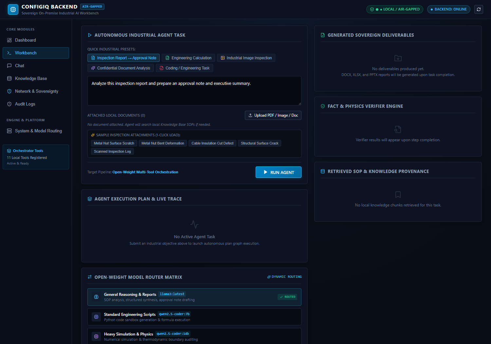
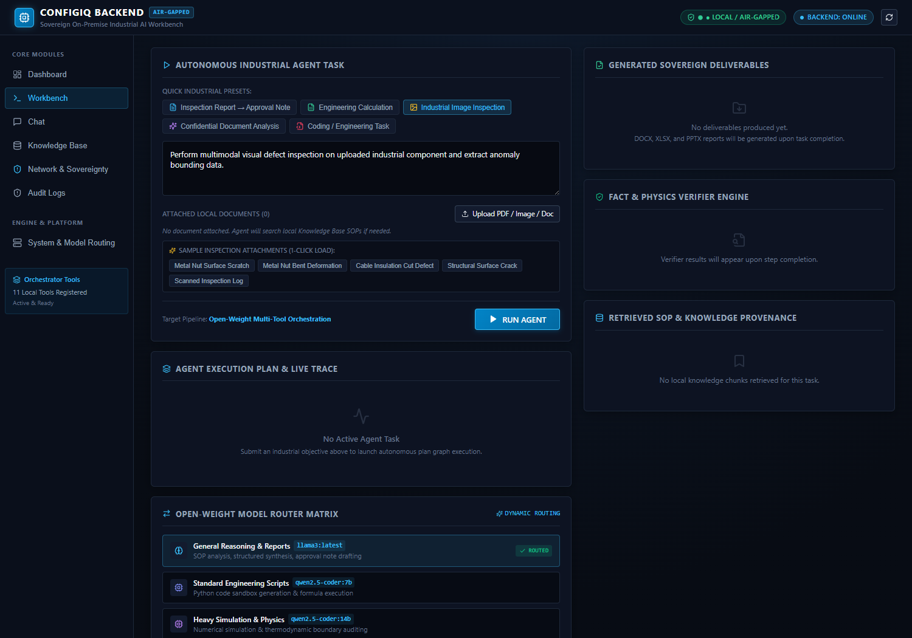
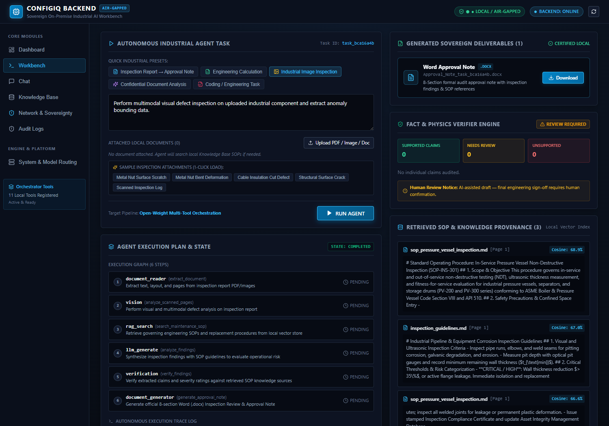
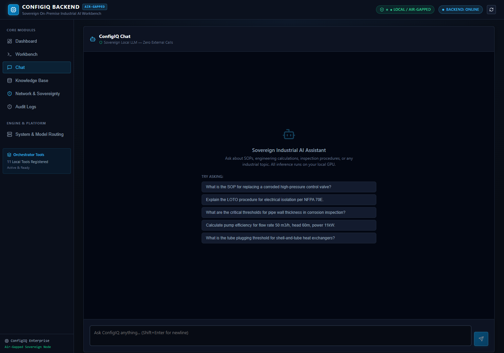
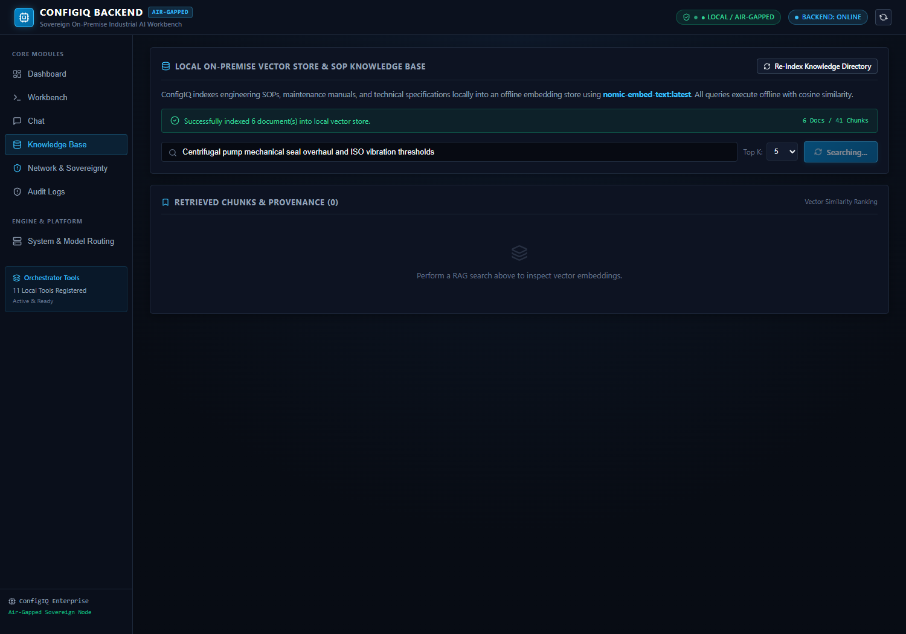
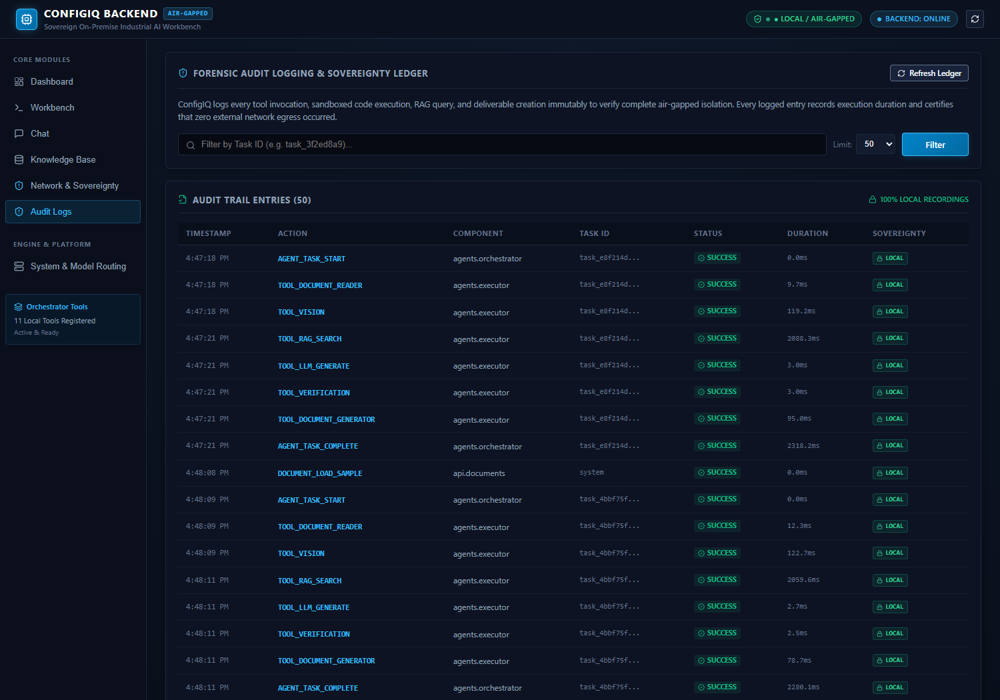

# ConfigIQ — Sovereign On-Premise Agentic AI Workbench

[](#sovereignty-guarantee)
[](LICENSE)
[](#testing)
[](#model-routing)

ConfigIQ is an autonomous sovereign agentic AI workbench engineered for confidential industrial engineering workflows. Operating in a 100% air-gapped environment with zero external telemetry or cloud dependencies, ConfigIQ processes complex technical inspection reports, extracts multimodal anomalies, queries local engineering SOP knowledge bases, executes isolated Python simulations, mathematically verifies factual claims, and generates certified Microsoft Office deliverables (`.docx`, `.xlsx`, `.pptx`).

📖 **[Read the Full Technical Documentation & Architecture Manual](DOCUMENTATION.md)**

---

## 📸 Production UI Overview

| Operations Dashboard | Autonomous Engineering Workbench |
| :---: | :---: |
|  |  |

| Execution Trace & Deliverables | Interactive Sovereign LLM Chat |
| :---: | :---: |
|  |  |

| Local SOP Knowledge Base (RAG) | Immutable SHA-256 Audit Ledger |
| :---: | :---: |
|  |  |

---

## 🌟 Key Capabilities

- **100% Air-Gapped & Sovereign**: Zero outbound telemetry. Continuous background packet telemetry monitors listening ports and intercepts unauthorized socket creation.
- **Multimodal Defect Inspection**: Local vision integration via `Moondream 2` detects component anomalies (scratches, deformation, cracks) with severity ranking and bounding boxes.
- **Local Dense SOP Retrieval (RAG)**: Indexes industrial procedures (valves, pumps, pressure vessels, heat exchangers, LOTO) into offline vector stores using `nomic-embed-text` with cosine similarity ranking.
- **Sandboxed Python Code Execution**: Runs thermodynamic and engineering calculations in an isolated subprocess sandbox with socket blocking and timeout enforcement.
- **Multi-Format Deliverable Generation**:
  - 📘 **Word Approval Note (`.docx`)**: Formally styled engineering memo with findings, risk assessment, and SOP citations.
  - 📊 **Excel Calculation Workbook (`.xlsx`)**: 4-sheet computation workbook with dynamic Excel formulas.
  - 📽️ **PowerPoint Executive Deck (`.pptx`)**: 5-slide briefing deck for plant leadership.
- **Dual-Stage Fact & Physics Verifier**: Audits all AI reasoning claims against retrieved SOP context (`SUPPORTED`, `UNSUPPORTED`, `NEEDS REVIEW`) and verifies numerical bounds.
- **Tamper-Evident SHA-256 Audit Trail**: Cryptographically chained execution ledger providing complete regulatory compliance.

---

## 🏗️ Architecture & Execution Flow

```text
                                 +-------------------------+
                                 |       User Task         |
                                 +------------+------------+
                                              |
                                              v
                                 +-------------------------+
                                 |      Agent Planner      |
                                 | (Structured Plan Graph) |
                                 +------------+------------+
                                              |
                                              v
      +---------------------------------------------------------------------------------+
      |                                Tool Executor                                    |
      |  +-----------------+  +-----------------+  +----------------+  +-------------+  |
      |  | document_reader |  |     vision      |  |   rag_search   |  |llm_generate |  |
      |  +-----------------+  +-----------------+  +----------------+  +-------------+  |
      |  +-----------------+  +-----------------+  +----------------+                   |
      |  |  code_executor  |  |  pdf_processor  |  |      ocr       |                   |
      |  +-----------------+  +-----------------+  +----------------+                   |
      +---------------------------------------+-----------------------------------------+
                                              |
                                              v
                                 +-------------------------+
                                 |     Verifier Engine     |
                                 | - Fact Provenance Match |
                                 | - Physics/Bounds Check  |
                                 +------------+------------+
                                              |
                                              v
                                 +-------------------------+
                                 |  Deliverable Generator  |
                                 | - Word (.docx)          |
                                 | - Excel (.xlsx)         |
                                 | - PowerPoint (.pptx)    |
                                 +------------+------------+
                                              |
                                              v
                                 +-------------------------+
                                 |  Verified Deliverables  |
                                 |      (in outputs/)      |
                                 +-------------------------+
```

---

## ⚡ Quick Start

### 1-Command Startup
```bash
# Clone the repository
git clone https://github.com/Bavadha-en/Soverign-Ai-Workbench.git
cd Soverign-Ai-Workbench

# Run launcher (starts backend and opens browser)
python run.py
```

### Manual Setup
```bash
# 1. Backend
python -m venv venv
venv\Scripts\activate
pip install -r requirements.txt
python -m uvicorn backend.main:app --host 127.0.0.1 --port 8000

# 2. Frontend
cd frontend
npm install
npm run dev
```

### Run Tests
```bash
python -m pytest tests -v
```

---

## 📚 Documentation Links
- **[Full System Documentation & User Manual](DOCUMENTATION.md)**
- **[Deployment & Air-Gap Configuration Guide](DEPLOYMENT.md)**
- **[Environment Variables Template](.env.example)**
- **[Sample Defect Datasets](datasets/sample_images/README.md)**

---

*ConfigIQ — Sovereign Agentic Intelligence for Confidential Engineering.*
